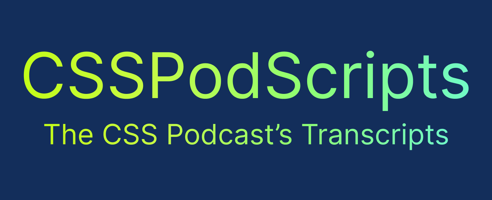

import Bleed from 'nextra-theme-docs/bleed'

<Bleed></Bleed>

# The CSS Podcast's Transcripts

Inspired by [Andrej Karpathy's work](https://karpathy.ai/lexicap/) for the podcast of Lex Fridman, I made the transcripts for my favorite [The CSS Podcast](https://pod.link/thecsspodcast) show.

Here is the summary of the process:

1. Parse the [RSS](https://thecsspodcast.libsyn.com/rss) of the podcast to get the episode audio URLs, episode titles, and episode slugs.
2. Use [OpenAI Whisper](https://github.com/openai/whisper)'s large model to transcribe the audios (just give the model the audio URLs and it will handle the rest).
3. Parse the output of the model and print them in a human-readable format.

To find out more, visit this [Colab notebook](google.com).

This website uses the document template by [Nextra](https://nextra.vercel.app/).
